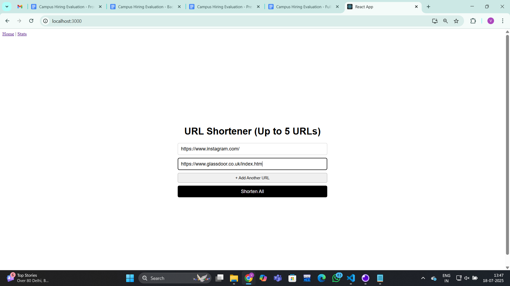
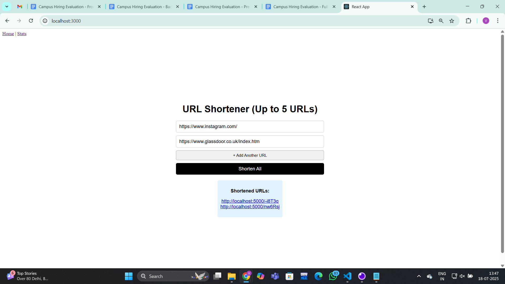
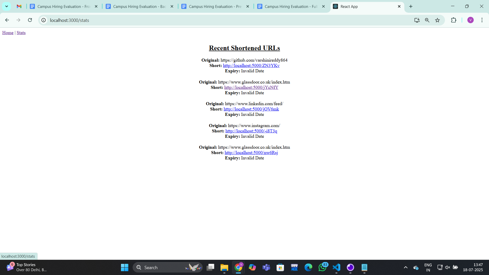

#  Simple URL Shortener (Full Stack)

A minimal full-stack URL shortener built with **React + Express**.

## 📸 Screenshots

### Home Page – URL Shortener



### Stats Page – Shortened URLs with Expiry


---

## 🛠 Tech Stack

- **Frontend**: React
- **Backend**: Node.js + Express
- **Database**: In-memory (can be upgraded)
- **HTTP Client**: Axios

---

## 🚀 Features

- Shorten any valid URL
- View all shortened links
- Auto-expiry after 24 hours

---

## 🔧 Setup Instructions

### Clone and Navigate

```bash
git clone https://github.com/varshinireddy864/22VE1A0599.git
cd 22VE1A0599
